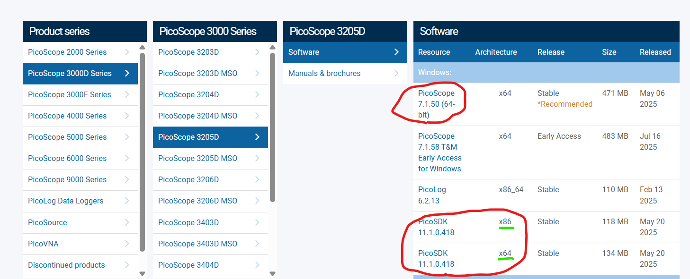

## Setting up The FTIR Scan

In this .README I will walk you through how to setup your computer to run the FTIR scan code and show you what results should be produced. As of right now there is no explanation of FTIR in the document (there will be eventually) so hopefully you know what it is. If not you should still be able to take this measurement with these instructions. 

## Installing Pico-Motor and Pico-Scope Control Software

**Picoscope:**

You will want to install the Picoscope 3205D GUI and SDK which can be found [here](https://www.picotech.com/downloads)

## Setting up Your Python Environment

Here I will show you how to setup your python environment in the context of Anaconda/VS Code. If you use something else its probably similar just adapt it to your needs.

(1) Clone the repository

(2) Activate the anaconda terminal and navigate the the root directory of the repository

(3) run the command "conda env create -f environment.yaml" this will create the conda environment using the provided .yaml file

(4) activate the environment using "conda activate YAG_exp"

## Testing Your Python Environment

After creating the python environment you will want to ensure that you are able to interface with both the picoscope 3205D and the Newport picomotor stage. To do this try to run the "motor_test.py" and "picoscope_test.py" scripts and fix any bugs that occur, feel free to contact Robert Miller if assistance is needed.

## Ensuring Spatial and Temporal Overlap

might need pyftdi installed, pylablib could be missing it.