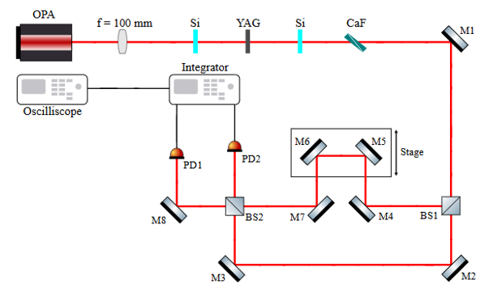
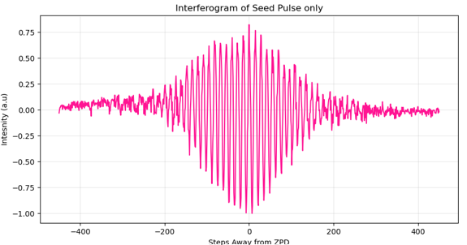
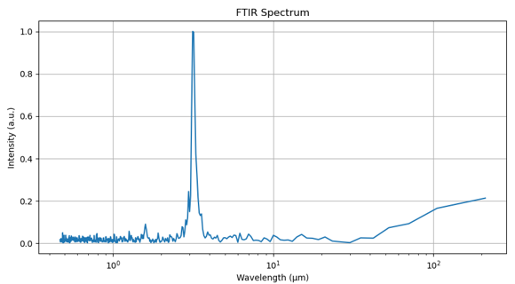
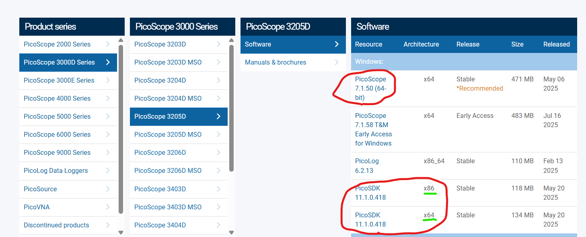
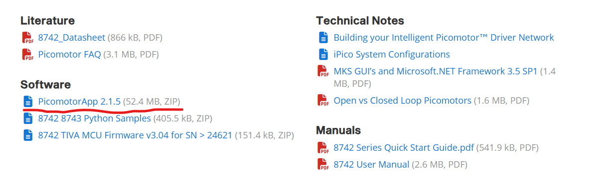

##  What is FTIR? 

Fourier Transform Infared Spectroscopy or (FTIR) is a method for obtatining the spectrum of some pulse train. The principles of operation are fairly simple. First an optical setup like the one below is built:

As the pulse train enters the system each pulse is split into two with one going along each arm of the interferometer. The lengths of the arms determine whether constructive or destructive interference will occur between the two pulses. This can be measured using a photodiode for the specified carrier frequencies. As the pulses are dragged across each other temporally (using the stage to change the OPD) the output signal amplitude will oscillate as the phase between the pulses change. The signal amplitude will oscillate in an envelope determined by the pulses intensity envelopes.

To retrieve the spectrum of the pulse train the pulses are set so that one is hitting the detector completely before the other one (so the stage is set such that the OPD is past temproal overlap). Then as the stage is moved in the direction necessary to drag the pulses across each other temporally a box car averaging scheme is used on the photodiode signal to produce an "interferogram" which will look something like:

The fourier transform of this signal is then taken and the spectrum is produced.

The "box car averaging scheme" simply applies a gate to the photodiode signal then sums each data point and divides by the width of the gate to produce a single scalar. This value is the data point for that stage position on the interferogram.

To produce the x axis of the spectrum as wavelength you need to know the step size which can be calibrated (see later sections for explanation how). 

## Setting up The FTIR Scan

Below I will walk you through how to setup your computer to run the FTIR scan code as well what the next steps should be.

## Installing Pico-Motor and Pico-Scope Control Software

**Picoscope:**

You will want to install the Picoscope 3205D GUI and SDK which can be found [here](https://www.picotech.com/downloads). Also see the **device-control** repository or **the link** for the API which can be useful for interpretting some of the codes arguments.

**Picomotor:**

You will also need the pico motor control software which is at the bottom of the page [here](https://www.newport.com/f/open-loop-picomotor-motion-controller)

## Setting up Your Python Environment

Here I will show you how to setup your python environment in the context of Anaconda/VS Code. If you use something else its probably similar just adapt it to your needs.

(1) Clone the repository

(2) Activate the anaconda terminal and navigate the the root directory of the repository

(3) run the command "conda env create -f environment.yaml" this will create the conda environment using the provided .yaml file

(4) activate the environment using "conda activate YAG_exp"

## Testing Your Python Environment

After creating the python environment you will want to ensure that you are able to interface with both the picoscope 3205D and the Newport picomotor stage. To do this try to run the "motor_test.py" and "picoscope_test.py" scripts and fix any bugs that occur, feel free to contact Robert Miller if assistance is needed.

**NOTE:** For you picoscope_test.py you will need to send a signal to the picoscope (from the function generator is the best for testing) and figure out what your range and trigger should be inside of the GUI first then put this into the scope configuration part of the code. I am currently working on simplifying the scope configuration to make it more pythonic and a bit easier to work with. For now if you have any quesiton please contact me (robert miller)

## Ensuring Spatial and Temporal Overlap

Before any measurements are attempted you should make sure that the following are done:

* The Mid-IR beam is aligned through the first two irises on the FTIR setup 

* The arms of the interferometer are spatially overlapped (use camera)

* The arms of the interferometer are temporally overlapped (scan stage, use camera)

To align the mid IR beam send it down the same axis as the green beam then reflect the green beam into the system and align. It should be the case that both Mid-IR spots will hit the camera. From there you can visually find spatial overlap then scan the stage towards you then away from you until you find temporal overlap (fringes). Once you have fringes optimize the spatial overlap until you get the minimum number of fringes possible.

## Measurement Procedure

Before starting a measurement one should ensure that they (1) have created the propper python environment and are able to interface with the stage and picoscope, (2) have aligned the system so that both spots are hitting the camera, and (3) Achieved satisfactory temporal/spatial overlap.

Before starting a scan you will want to first do the following:

* Open the picoscope GUI and set the scope settings so that you are able to view the pulse signal. You will need to write down these settings as they are parameters in the code to run the scan. 

* Now with either the pico-motor app **or** the "motor_test.py" script, you will want to scan the stage until you are on one side of the temporal overlap region. This means scanning from one direction into the direction towards the desired side (+ or -) and watching the interference pattern until there is no more temporal overlap. You will want to note whether you are on the positive or negative side of the region so that you can scan in the opposite direction. 

* At this point you will need to run the FTIR_scan_example.py script (or some custom copy of it) with the desired scope and scan configurations.

## Final Notes / Next Things to do

At the time of my departue (7/26/25) the following was done:

* A Si window was added infront of the photodiode to get rid of the ~1um noise.

* Preliminary scans were run showing a clear spike at ~3um the attenuation of the laser was optimized to ~71-72% with a 50 Hz repition rate (the frequency is less important)

Things that should be done/looked into:

* The motor step size seems to be quite a bit off of spec. I suspect this could be due to how light the mirror stands are but I am not sure. Either way one should properly calibrate the step size. To do this I reccomend running scans with just the OPA input and using the step differences between the peaks on the interferogram along with the known carrier frequency of the pulse train to calculate the actual step distance. I would do 3 trials @ several different "step_intervals" and determine if the step size is consistent. 

* The signal seems to vary widely with the attenuation settings on the OPA controls. The main reason for modifying the attenuation settings is to overcome diode saturation. So if you can find another way to decrease the intensity of the pulses without adjusting the attenuation percentage (and thus the stability of the input) that would work as well. Either way one must look into optimizing the attenuation settings or somehow overcoming diode saturation by some other means. Note that I am assuming diode saturation is occuring due to the interferogram asymmetries on the top and bottom. 

* Explore spectral broadening in YAG and a YAG-Si system.

* Add a beam splitter to the OPA input so that the parabola and FTIR setup can be used at the same time.

* Implementing the analog integrator and using the DC signal to generate the interferogram rather than using a digital gate/integration.