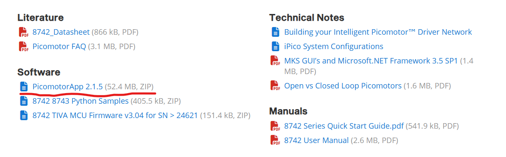

## Setting up The FTIR Scan

In this .README I will walk you through how to setup your computer to run the FTIR scan code and show you what results should be produced. As of right now there is no explanation of FTIR in the document (there will be eventually) so hopefully you know what it is. If not you should still be able to take this measurement with these instructions. 

## Installing Pico-Motor and Pico-Scope Control Software

**Picoscope:**

You will want to install the Picoscope 3205D GUI and SDK which can be found [here](https://www.picotech.com/downloads)

**Picomotor:**

You will also need the pico motor control software which is at the bottom of the page [here](https://www.newport.com/f/open-loop-picomotor-motion-controller)

## Setting up Your Python Environment

Here I will show you how to setup your python environment in the context of Anaconda/VS Code. If you use something else its probably similar just adapt it to your needs.

(1) Clone the repository

(2) Activate the anaconda terminal and navigate the the root directory of the repository

(3) run the command "conda env create -f environment.yaml" this will create the conda environment using the provided .yaml file

(4) activate the environment using "conda activate YAG_exp"

## Testing Your Python Environment

After creating the python environment you will want to ensure that you are able to interface with both the picoscope 3205D and the Newport picomotor stage. To do this try to run the "motor_test.py" and "picoscope_test.py" scripts and fix any bugs that occur, feel free to contact Robert Miller if assistance is needed.

**NOTE:** For you picoscope_test.py you will need to send a signal to the picoscope (from the function generator is the best for testing) and figure out what your range and trigger should be inside of the GUI first then put this into the scope configuration part of the code. I am currently working on simplifying the scope configuration to make it more pythonic and a bit easier to work with. For now if you have any quesiton please contact me (robert miller)

## Ensuring Spatial and Temporal Overlap

Before any measurements are attempted you should make sure that the following are done:

* The Mid-IR beam is aligned through the first two irises on the FTIR setup 

* The arms of the interferometer are spatially overlapped (use camera)

* The arms of the interferometer are temporally overlapped (scan stage, use camera)

To align the mid IR beam send it down the same axis as the green beam then reflect the green beam into the system and align. It should be the case that both Mid-IR spots will hit the camera. From there you can visually find spatial overlap then scan the stage towards you then away from you until you find temporal overlap (fringes). Once you have fringes optimize the spatial overlap until you get the minimum number of fringes possible.

might need pyftdi installed, pylablib could be missing it.